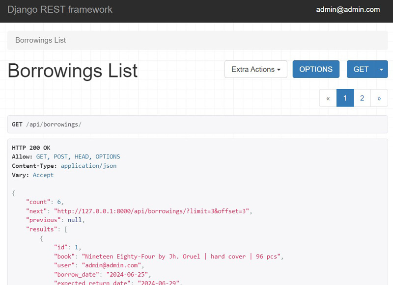
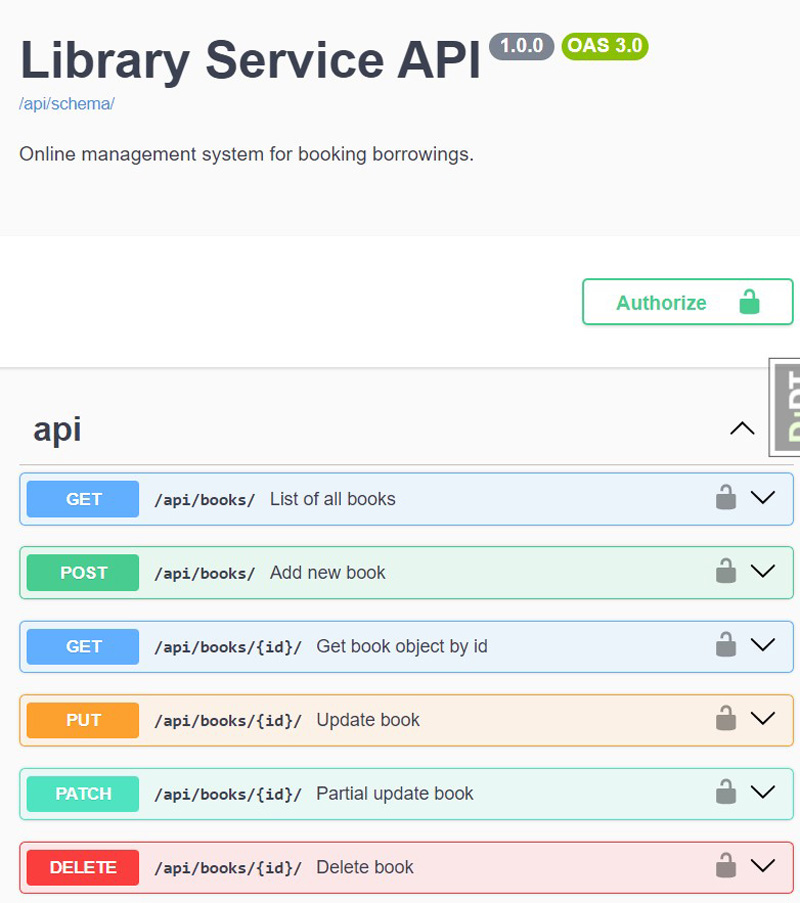
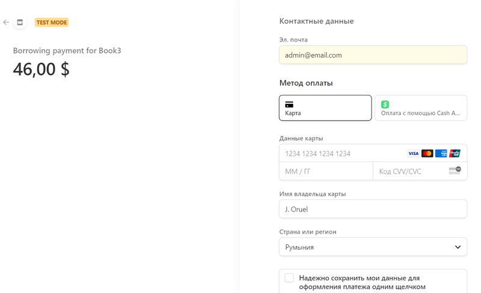
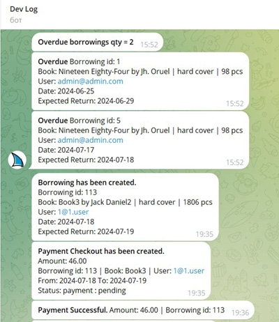

# Library Service API Project

Library Service RESTful API is based on Django REST Framework and suitable for managing library main processes and activities   
Managing instances of books, tracking book borrowings for fee, payments accounting and support payment sessions - 
make the service much more user-friendly.


### Features:
- Managing of books - full CRUD functional
- Check of books inventory 
- Managing Users & access rights
- Managing of books borrowings & returns
- Managing payments & fines
- Display notifications
- Support credit card online payments by Stripe
- Notifications via Telegram about all actions with books, borrowings, 
  payments and tracking overdues borrowings and expired payment sessions

___
### Tech Stack & System requirements :

* Python 3.+
* Django 5.+ 
* Django Rest Framework (DRF) 3.+ 
* JWT Token Authentication
* PostgreSQL Database or SQLite (as development local base) 
* Celery
* Django Celery Beat & crontab
* Redis (used as a Broker & Backend)
* Flower (monitoring for Celery)
* Drf spectacular (Swagger UI documentation)
* Stripe Online Payment system
* Telegram bot TelegramBotAPI
* Coverage test
* Docker Containerization

---
### Installation using GitHub
- Python3 must be already installed

1. Clone GitHub repository:
```
https://github.com/u123dev/Library-Service.git
```
  - You can get the link by clicking the `Clone or download` button in your repo

2. Open the project folder in your IDE

or 
```
cd library_service
```
3. Make virtual environment and install requirements in it:
```
py -m venv venv
venv\Scripts\activate (on Windows)
# or
source venv/bin/activate (on macOS)
pip install -r requirements.txt
```
4. DATABASE:
- a) You need to Install **PostgreSQL**

Create environment variables (or specify in .env file): 
```
set POSTGRES_DB = <db name>
set POSTGRES_USER = <db username>
set POSTGRES_PASSWORD = <db user password>
set POSTGRES_HOST = <db host>
set POSTGRES_PORT = <db port>
```
or 
- b) You can use built-in SQlite by default

5. Migrate & make database:
```
py manage.py migrate
```
6. To create demo admin user:
```
py manage.py init_superuser
```
7. Run Redis Server: 
```
docker run -d -p 6379:6379 redis
```
8. Run Celery Worker & Beat (as a separate service): 
```
celery -A library_service worker -l -E info -n worker_library_%n
celery -A library_service beat -l info --scheduler django_celery_beat.schedulers:DatabaseScheduler
```
9. Run Flower (Celery monitoring):
```
celery -A library_service flower
```
10. Run Project:
```
py manage.py runserver
```
 
---

### Run with Docker containers
 System requirements:

* **Docker Desktop 4.+**

Run project:
```
docker-compose up --build
```

Please note:
   * Copy [sample.env](sample.env) file to **.env** & set environment variables 


### Getting access:
1. Access API Services in browser (main entries):
   - [http://127.0.0.1:8000/api/books/](http://127.0.0.1:8000/api/books/)
   - [http://127.0.0.1:8000/api/borrowings/](http://127.0.0.1:8000/api/borrowings/)
   - [http://127.0.0.1:8000/api/payments/](http://127.0.0.1:8000/api/payments/)
   - [http://127.0.0.1:8000/api/user/](http://127.0.0.1:8000/api/user/)


2. Access Flower / Celery tasks monitoring:
   - [http://127.0.0.1:5555/tasks/](http://127.0.0.1:8000/5555/tasks/)


3. Admin panel:
   - [http://127.0.0.1:8000/admin/](http://127.0.0.1:8000/admin/)


4. After loading init data you can use demo admin user:
   - Email (as Login): `admin@email.com`
   - Password: `admin`

5. Register new user:
   - **api/user/** 

6. Obtain pair an access authentication & refresh tokens by sending a POST user credentials - email(as login) & password: 
   - **api/user/token/** 

7. Header to access endpoints:
   - **Authorize: Bearer *<Access Token>***

8. To use Telegram notifications:
   - It is presumed that you have obtained an API token with [@BotFather](https://telegram.me/BotFather). It is called TOKEN.
   - And you have created chat with CHAT_ID number and connected to it.

9. To use [Stripe.com](https://dashboard.stripe.com/) Payment Online System sign in and get API Key.

### Documentation 
 
Swagger via:
- **api/schema/swagger-ui/** 

Redoc via:
  - **api/doc/redoc/**

### Test Coverage Report: 96% ###
 
```
coverage run manage.py test 
coverage html
```

### Demo








### Contact
Feel free to contact: u123@ua.fm
